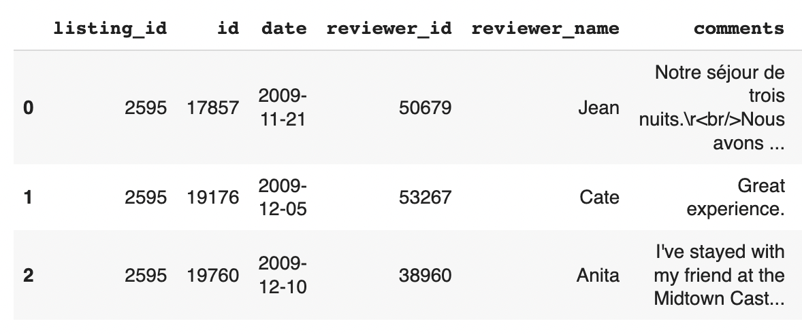

# Airbnb Review Analysis Classifier

## Summary
More business rely on recommendation and consumer reviews such as Yelp, TripAdvisor, Google Reviews, and Zocdoc. How can companies understand what items are important to the customers using their products, or by product review? For customers who give high or low ratings, what factors contribute to their final rating?

Using classification algorithms, data can be analyzed to break down reviews into their thematic components, and applied to future reviews to analyze why a consumer might rate an item or listing the way they do.

## Download Requirements
Due to hardware limitations, the code for this project was run using [Google Colab](https://colab.research.google.com/). The datasets used for the project were large, and are currently stored on a shared cloud file: [kchien_data](https://drive.google.com/drive/folders/1aVfT2q2oqjpRhgpyDVdP1l314-UM7Ljl?usp=sharing).

The run the code, the shared file needs to be downloaded and saved into a Google MyDrive for access.

## Data Collection
Airbnb is an online marketplace that lists lodgings, home stays, vacation rentals, and tourist activities. Customers can book these listings, and refer to previous customers who participated in the activity, or stayed at the rental, to find out previous customers' experiences.

Ratings and reviews are extremely helpful data points for potential customers, and it is generally beneficial for Airbnb hosts to have higher ratings, and positive reviews.

Around 890,000 reviews for Airbnb listings in New York City, and their corresponding ratings were collected for analysis and model training.

## Preprocessing

langdetect library was used to identify each review's language. Non-English reviews were dropped from the dataset. Further analysis within non-English reviews showed that langdetect miscategorized reviews 15 words or less as non-English. For the remaining dataset in English, reviews that were 15 words or less were dropped.

Of the 890,000 reviews, the final clean dataset contained around 600,000 reviews for analysis and training.

## Data Analysis
Using the cleaned dataset, a CountVectorizer was used to analyze recurring themes among the 600,000 reviews. The text was analyzed using unigrams and bigrams, and analyzed by listing reviews to see if more themes or words were common if a listing had 0 out of 5 stars, 1 out of 5 stars, etc.

Based on this analysis, the following Airbnb themes appeared, and were assigned as targets for modeling:
- **Location** (walking distance, subway, close subway, great location, minute walk, times square, central park, blocks away, location close, metro station, neighborhood, nearby, close)
- **Host** (great host, quick respond, communication, host, responsive, accommodating, welcoming, welcoming)
- **Hygiene** (place clean, apartment clean, clean comfortable, room clean, super clean, clean)
- **Comfort** (bed comfortable, comfortable, like home, nice place, place nice, spacious, safe)
- **Cost** (great value, value)

## Imbalanced Classes
Of the themes extracted, most were relative balanced with the exception of Location, Host, and Cost. Cost had the most imbalanced class with only 10% of reviews mentioning costs or price.

To train the model better, undersampling, oversampling, and weighted classes were applied

## Model Measurements
Since the purpose of the model is to extract themes, **accuracy**, **recall**, and the model's ability to generalize to new data were the primary outcome measurements.

A Logistic Regression was used to classify each category. Performance for the training set was compared to the test set to check for variance and the model's ability to generalize to new review data.

## Dealing with Imbalanced Classes
Of the themes extracted, most were relative balanced with the exception of Location, Host, and Cost. Cost had the most imbalanced class with only 10% of reviews mentioning costs or price.

To train the model better, undersampling, oversampling, and weighted classes were applied to the models. While these techniques had little model impact on boosting performance for Location and Host. However, balancing the classes dramatically improved the Cost model from **86% recall** to **92% recall**.

## Results
|Target|Baseline|Accuracy|Recall|Train v. Test|
|---|---|---|---|---|
|Location|65%|99%|97%|Train: 99%, Test: 98%|
|Host|65%|99%|97%|Train: 99%, Test: 98%|
|Hygiene|62%|99%|98%|Train: 99%, Test: 98%|
|Comfort|58%|99%|93%|Train: 99%, Test: 96%|
|Cost|85%|99%|92%|Train: 99%, Test: 99%|

## Streamlit
The model can be accessed by running the [Streamlit Model](https://github.com/karenongithub/airbnb-reviews/blob/main/streamlit_model.py). Using streamlit, any Airbnb review from New York City or other major American city can be inputted into the streamlit, and the review contents can be synthesized.

## Further Analysis
1. Additional bigram and unigram analysis, and part-of-speech tagging to further differentiate within themes: Using the location of adjectives, adverbs, or bigrams of specific phrases, the model can be further applied to see what about each themes might contribute to high or low ratings (i.e. for location, if a review mentions it is far or close, does that contribute to how a consumer might rate the Airbnb?)
2. Explore if reviews impact on a listing's overall score: During the exploratory data analysis, it was discovered negative reviews did not directly correspond to the listing's overall score. For example, if there were multiple reviews mentioning a "dirty" listing, a listing was still likely to have an overall rating of 4-5 stars. To further improve the model, more detailed analysis can be done and pulled into the model.
